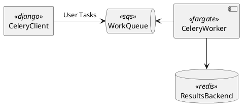

- [apigw-websocket-api-fargate-cdk](https://github.com/aws-samples/serverless-patterns/)
- [aws-batch-celery-worker-example](https://github.com/aws-samples/aws-batch-celery-worker-example)
```
python3 -m venv .venv
source .venv/bin/activate
pip install -r requirements.txt
pip install -r requirements-dev.txt
npx cdk synth
pytest
```



